## Sintos

#### Framework: Nuxt JS

#### Module 5: Alumni Hub

#### Installation

To replicate and run this project follow the following steps using Windows Powershell:

```bash
winget install OpenJS.NodeJS.LTS
nvm install lts
nvm use lts
https://github.com/ksintos/firstattempt2026_Sintos.git
cd alumni-portal
npm run dev
```

### AI Tools:

1. Chat GPT Codex 5.2 (VS Code Copilot)


### Prompt:

I want you to install Nuxt.js into my system and use it for the task I am about to give you.

Make a Web about this Alumni App, Copy its exact layout dont add or delete anything, but make it responsive, Make it connect to one another, Login Page, Sign up Page, Forget Password, admin/alumni choice, Alumni Home Page, Alumni Profile, Alumni Events, Alumni Donations, Alumni Notifications, Donation Details, Donation History, Donation Checkout page.

This is for Admin

Admin Home Page, Create Donation, Donation Options, Donation Page, Batch Rankings, Admin Notifications, 

when I open the site it should direct me to the login page, and when I click signup it will direct me to the sign up page, and when I click done it will redirect me back to the login page, and when I click login, it should direct me to the role choose where i choose whether admin or alumni then it will show its different parts, make it connect, nav bar, symbols, so that every page can be directed to with the right navigation

ask me any clarifactory questions you may need to complete this task.

#### Screenshots

##### Login

<p>
	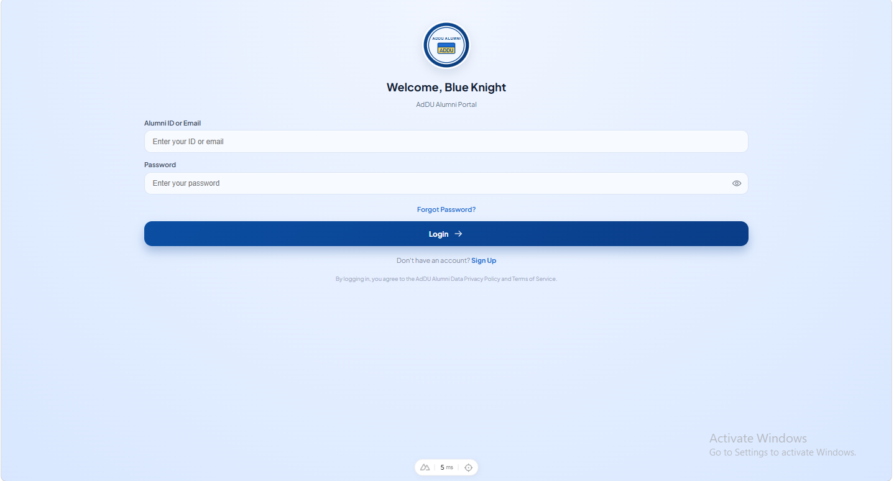
	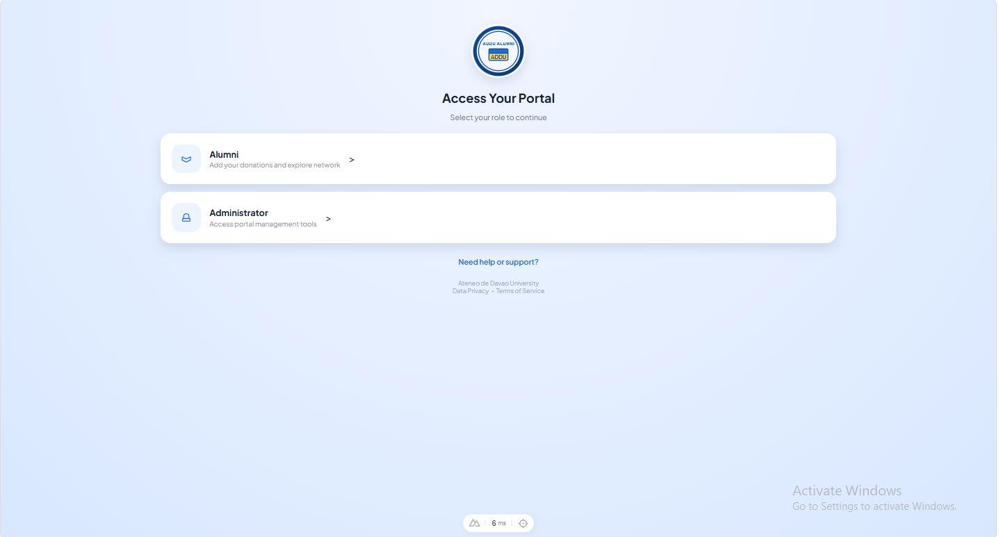
</p>

##### Alumni

<p>
	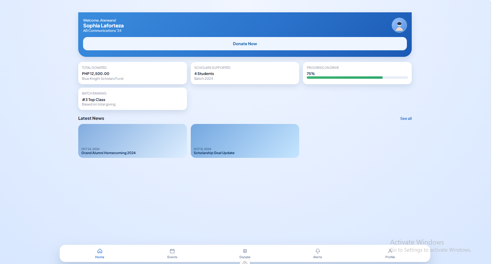
	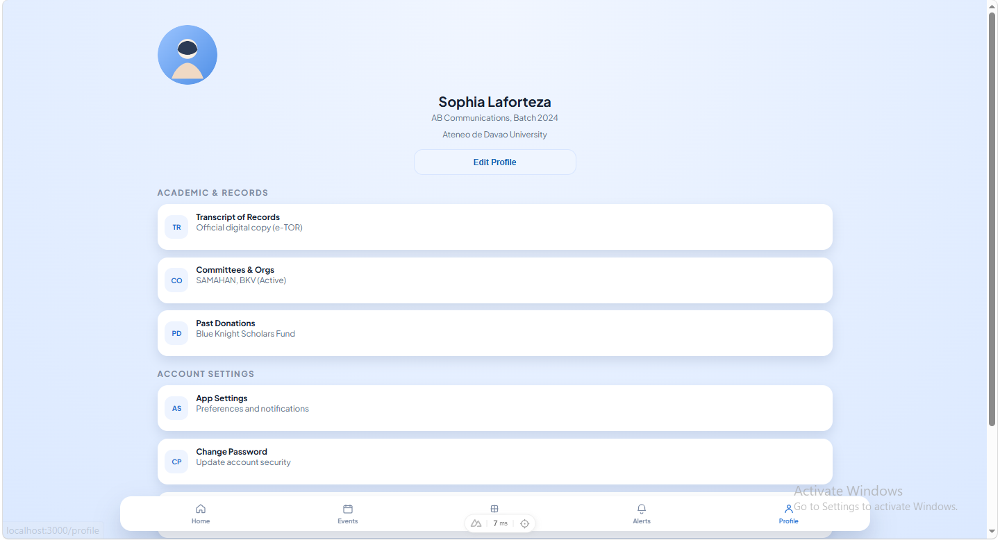
	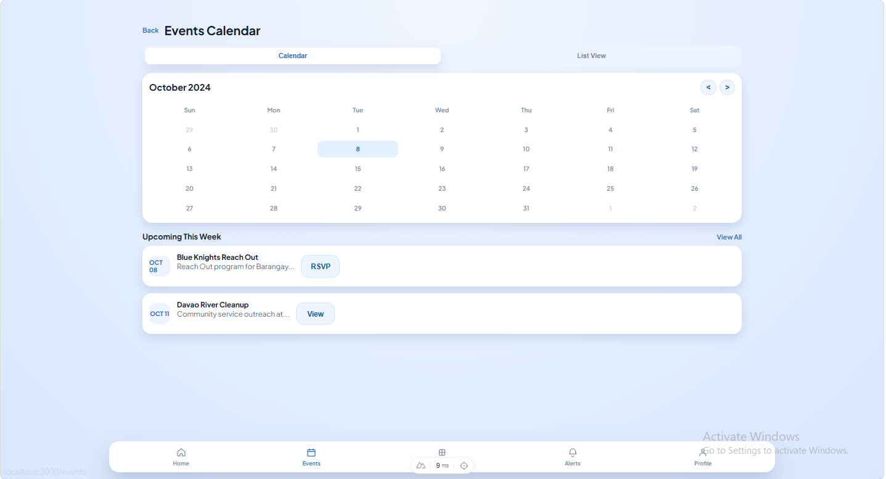
	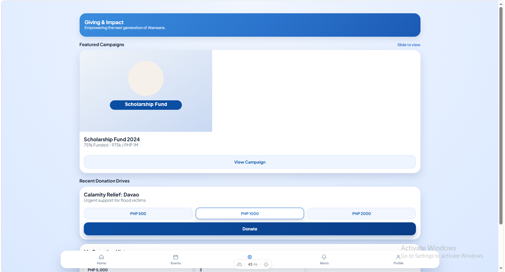
	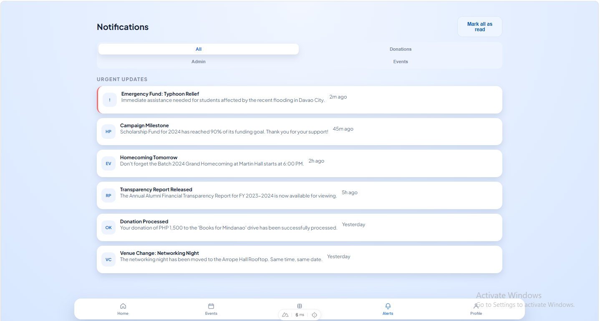
	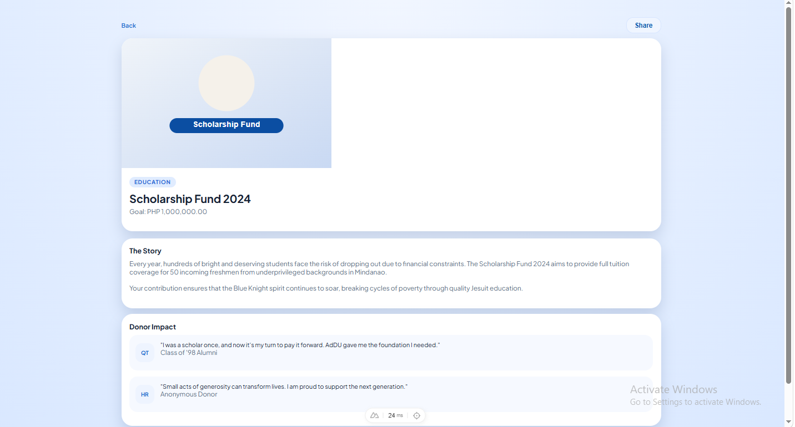
	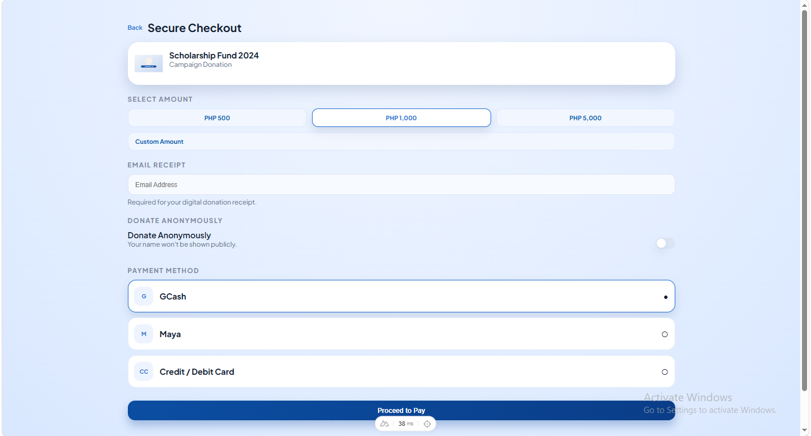
</p>

##### Admin

<p>
	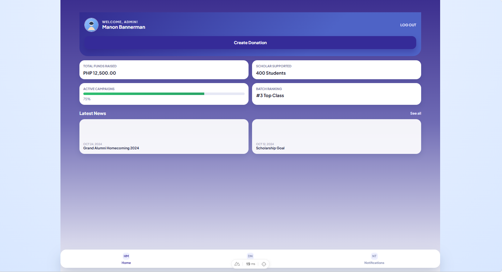
	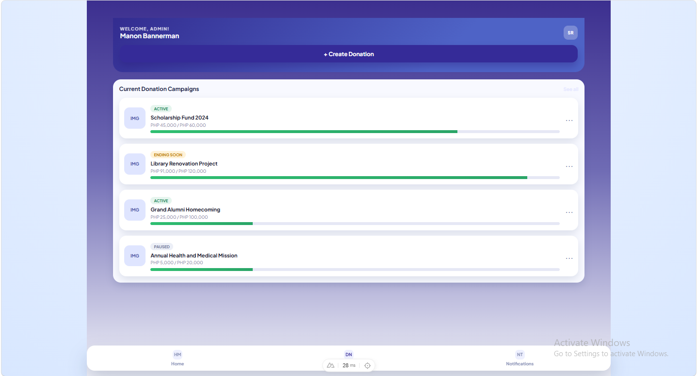
	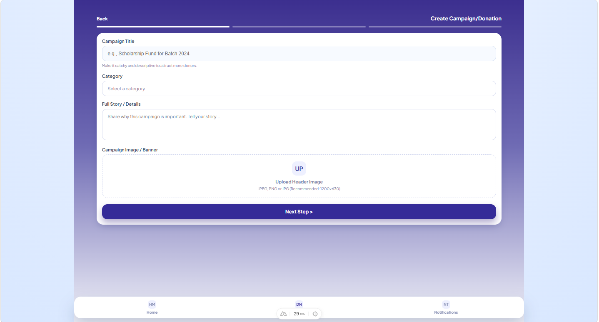
	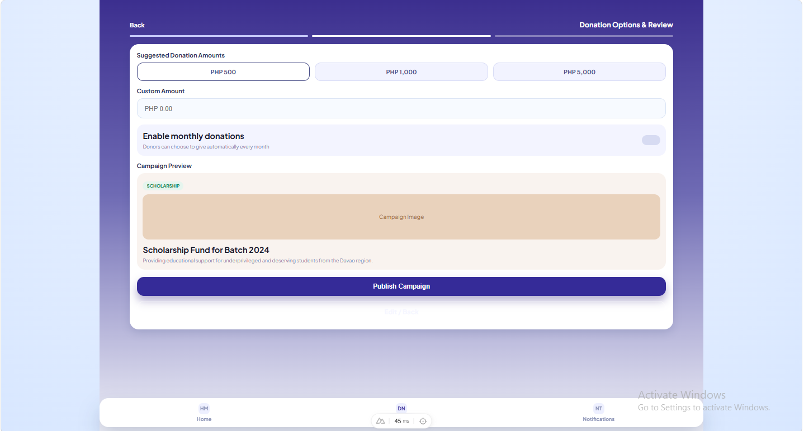
	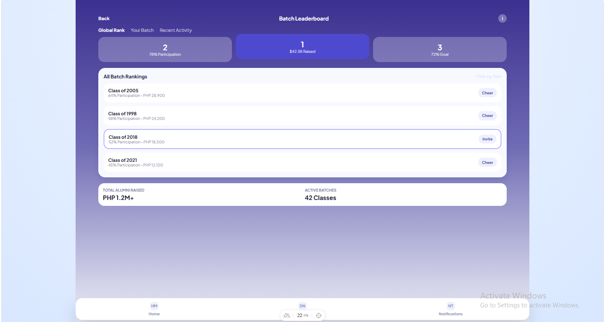
	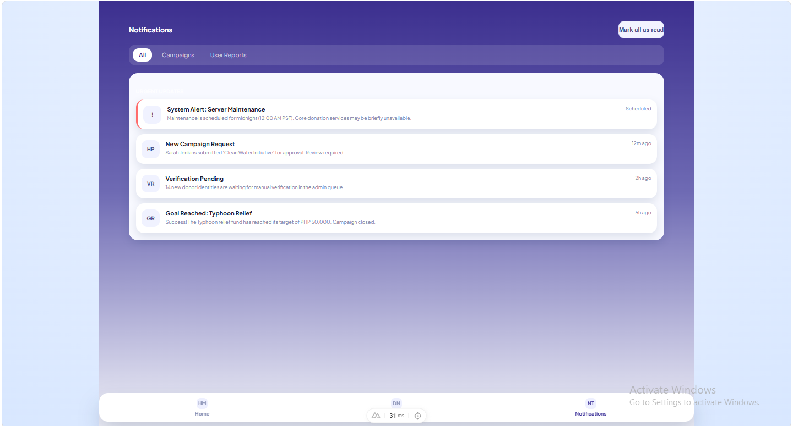
</p>
